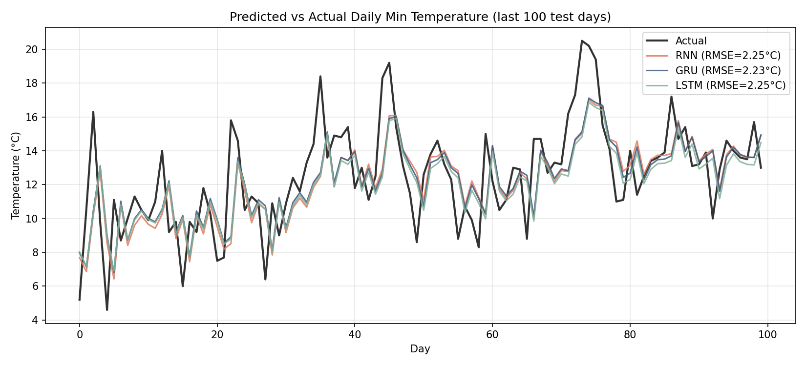
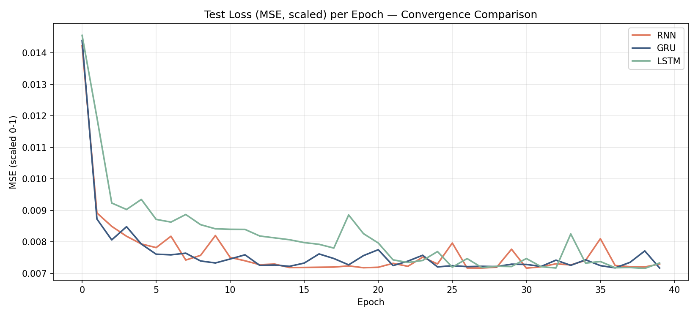
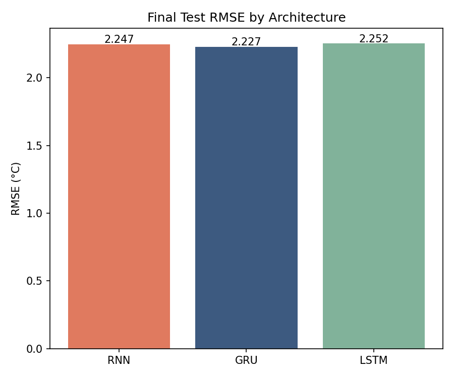

# RNN vs GRU vs LSTM: Daily Temperature Forecasting

A controlled comparison of vanilla RNN, GRU, and LSTM architectures on a
real-world time series, built to understand *when and why* gated recurrent
units actually outperform simple RNNs — not just how to call `nn.LSTM()`.

## Data

[Daily minimum temperatures in Melbourne, Australia, 1981–1990](https://raw.githubusercontent.com/jbrownlee/Datasets/master/daily-min-temperatures.csv)
(3,650 daily observations). A classic time series benchmark: strong
seasonality, realistic day-to-day noise, no missing values.

- **Input**: 30-day sliding window of past temperatures
- **Target**: next day's minimum temperature
- **Split**: chronological (85% train / 15% test) — *not* randomly shuffled,
  since shuffling a time series leaks future information into training.

## Method

All three models share an identical setup so the only variable is the
recurrent cell itself:

| | Hidden size | Layers | Optimizer | LR | Epochs | Batch size |
|---|---|---|---|---|---|---|
| RNN / GRU / LSTM | 32 | 1 | Adam | 1e-3 | 40 | 32 |

Same random seed, same weight initialization scheme, same train/test split.

## Results

| Model | Test RMSE (°C) | Parameters |
|---|---|---|
| Vanilla RNN | 2.247 | 1,153 |
| GRU | **2.227** | 3,393 |
| LSTM | 2.252 | 4,513 |





## Interpretation

**All three architectures perform almost identically here — and that's the
actual finding, not a failure.** GRU and LSTM exist to solve the vanishing
gradient problem, which shows up when a model needs to remember information
across *long* sequences. A 30-day input window isn't long enough to stress
that limitation, so the vanilla RNN can keep up with its gated cousins
despite having roughly a third of their parameters.

This matters practically: for short-window forecasting tasks like this one,
a vanilla RNN is a perfectly reasonable (and cheaper, faster-to-train)
choice. The gap between architectures would be expected to widen on tasks
with longer effective memory requirements — e.g. text generation, or
forecasting with a much longer lookback window.

**All models under-predict sharp peaks and lag behind fast swings.** This is
a signature behavior of MSE-trained sequence models on noisy data: the loss
function rewards being "safely close" to the recent trend over committing to
a sharp move, so the model effectively learns a smoothed, delayed tracking
of the actual series rather than genuine forecasting of turning points.

## What I'd try next

- Longer lookback window (60–90 days) to see whether GRU/LSTM start to pull
  ahead of vanilla RNN as sequence length increases
- Multivariate inputs (e.g. adding day-of-year as a cyclical feature) to
  give the model an explicit seasonality signal instead of making it infer
  one from raw temperature history alone
- A naive persistence baseline (predict tomorrow = today) as a sanity floor,
  since a sophisticated model that can't beat a one-line baseline is a red
  flag worth catching early

## Project structure

```
rnn-gru-lstm-project/
├── data/
│   └── daily-min-temperatures.csv
├── src/
│   ├── data_prep.py      # loading, scaling, windowing
│   ├── models.py         # RNN / GRU / LSTM definitions
│   ├── train.py          # shared training loop, saves results.json
│   └── visualize.py      # generates comparison plots
├── outputs/
│   ├── results.json
│   ├── predictions_comparison.png
│   ├── training_curves.png
│   └── rmse_comparison.png
└── README.md
```

## Reproducing

```bash
pip install torch pandas numpy matplotlib scikit-learn
cd src
python train.py       # trains all 3 models, saves outputs/results.json
python visualize.py   # generates the 3 comparison plots
```
